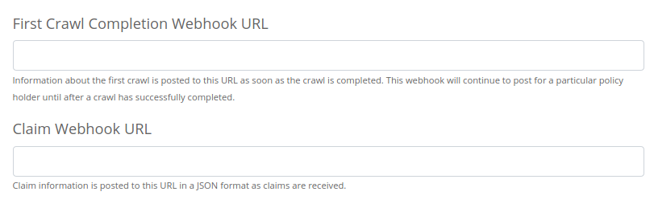
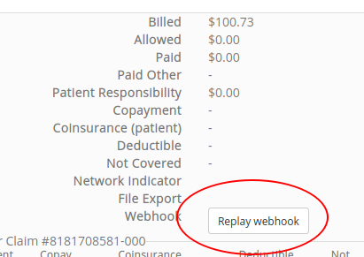
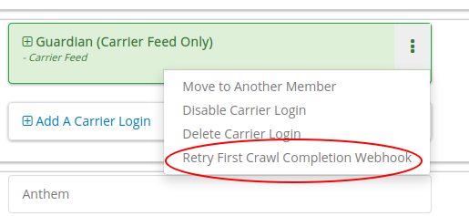

.. _connect:

..................
TPA Stream Connect
..................

Client Library
==============

*****
Usage
*****

Our `JavaScript Client Library <https://github.com/TPAStream/stream-connect-js-sdk>`_
is designed to allow users of your Web or Mobile application to connect their
Health Insurance accounts with your Application.

To get up and running, you can simply copy and paste the JavaScript snippets
below, and run it in `isDemo` mode today. You can use the provided callbacks to
customize the look, feel, and overall experience for your users.

**************************
Detailed Client-Usage Docs
**************************
We highly suggest taking a look at our 
`Detailed Client-Usage Docs <https://github.com/TPAStream/stream-connect-js-sdk/blob/master/docs/client-usage.md#client-usage>`_ 
on github while attempting to implement the SDK.

********************************
Other Useful Documentation Links
********************************
`Quickstart <https://github.com/TPAStream/stream-connect-js-sdk/blob/master/docs/quickstart.md>`_ 
`FAQ <https://github.com/TPAStream/stream-connect-js-sdk/blob/master/docs/faq.md>`_ 
`Error Documentation <https://github.com/TPAStream/stream-connect-js-sdk/blob/master/docs/error.md>`_ 
`SDK Flow <https://github.com/TPAStream/stream-connect-js-sdk/blob/master/docs/sdk-flow.md>`_ 

*****************
JavaScript Client
*****************

-----------
Source Code
-----------

You can find the source code to our JavaScript Client here:
https://github.com/TPAStream/stream-connect-js-sdk

*************************
NPM Example (recommended)
*************************

.. code-block:: javascript

    npm i stream-connect-sdk
 
    import StreamConnect from 'stream-connect-sdk';
   
    const sdk = StreamConnect({
        el: '#react-hook',
        isDemo: true
    });

***********
CDN Example
***********
.. code-block:: html

    
    

As of SDK version 0.4.7 the CDN provider is now versioned and will support up to 10 minor versions behind.
 * Importing the various versions of the SDK is handled in :code:`src` attribute on your script tag
    * "https://app.tpastream.com/static/js/sdk.js" --> Grabs the latest version of the SDK
    * "https://app.tpastream.com/static/js/sdk-v-<VersionNumber>.js" --> For a specific version. Examples below.
        * "https://app.tpastream.com/static/js/sdk-v-0.4.7.js"

---------------------
SDK Client Usage Docs
---------------------

We highly suggest taking a look at our 
`Detailed Client-Usage Docs <https://github.com/TPAStream/stream-connect-js-sdk/blob/master/docs/client-usage.md#client-usage>`_ 
on github while attempting to implement the SDK.

There you will find explanations for all of the various callbacks in the example above as well as explanations for
the various configuration paramters.

***************
Android Example
***************

In Android, you can implement the JavaScript SDK by creating an html
file in your assets folder that loads the SDK, then loading it in a
WebView. Here's a simple example implementation in Java.

.. code-block:: java

  public class ViewWeb extends Activity {
      @Override
      public void onCreate(Bundle savedInstanceState) {
          super.onCreate(savedInstanceState);
          setContentView(R.layout.content);
          WebView webview = (WebView) findViewById(R.id.webView);
          webview.loadUrl("file:///android_asset/stream-connect.html");
      }
  }

***********
iOS Example
***********

In iOS, you can implement the JavaScript SDK by creating a directory
in your project ("stream-connect" in the below example), and putting an
html file in it (index.html in the below example) that loads the SDK. You
can then load it into a WKWebView. Here's a simple example implementation in
Objective-C.

.. code-block:: objective-c

  import UIKit
  import WebKit
   
  class ViewController: UIViewController, WKUIDelegate, WKNavigationDelegate {

      @IBOutlet weak var webView: WKWebView!
      override func viewDidLoad() {
          super.viewDidLoad()
          webView.uiDelegate = self
          webView.navigationDelegate = self
          let url = Bundle.main.url(forResource: "index", withExtension: "html", subdirectory: "stream-connect")!
          webView.loadFileURL(url, allowingReadAccessTo: url)
          let request = URLRequest(url: url)
          webView.load(request)
      }
  }

**********
Change Log
**********
---------------
v0.4.8 (Latest)
---------------
    * Add individual endpoints for the following: payer and terms of service
    * Seperate the versions of the api and create a version manager.
    * Drastically improve initial endpoint loadtime by bringing down less info.
------
v0.4.7
------
    * Add versioning to the CDN provider
    * Append version to all request headers for underlying api to read.

Webhooks
========

*************
Claim Webhook
*************

TPA Stream offers a claim webhook feature in which TPA Stream will post new
claims to a customer-provided endpoint.

-------
Trigger
-------
The claim webhook will fire whenever a new claim is processed in TPA Stream.

-----------------
Claim Webhook URL
-----------------

To edit the claim webhook URL, click on "Account Settings" on the settings page.

Note that you will only see this setting if the claim webhook feature is enabled.

Once the webhook URL has been updated, all future posts will go to that URL.

----------------------
Replaying a Claim Post
----------------------

To manually replay a claim post, find the appropriate claim on the claims page
and click the "Replay webhook" button.  If the button is not shown, please
verify that the webhook feature is enabled and a URL is set as described above.
This "replay" functionality is useful for testing, and can also be used to
trigger a webhook for any pre-existing claims that are in the system, if desired.

******************************
First Crawl Completion Webhook
******************************

TPA Stream also offers a crawl webhook feature that posts details about the
first crawl of a policyholder to a customer-provided endpoint.

-------
Trigger
-------
The first crawl completion webhook will fire after all the claims for the first
crawl of a policyholder have been processed.  If this crawl is successful, that 
will be the last time the webhook fires for the policyholder.  If the crawl 
fails, the trigger will fire again on the next crawl.  This will occur until 
a crawl has successfully completed for the policyholder.  For example, if the 
first two crawls fail and the next two ones succeed, 3 POST requests will be 
made.  Two for the failures and a third, final POST for the first success.

Note if you create a new member and associate it with an existing carrier login,
the system will not fire the webhook if that existing carrier login has already
had a successful first crawl.  Even though the member is new, the system 
reuses the existing carrier login (policyholder).

----------------------------------
First Crawl Completion Webhook URL
----------------------------------

To edit the first crawl completion webhook URL, click on "Account Settings"
on the settings page similar to editing the claim webhook URL.

---------------------------------
Replaying a Crawl Completion Post
---------------------------------

To manually replay a first completion webhook post, find the appropriate member
on the member page.  Under policy holders, there will be a button to replay
the webhook request.  If the button is not shown, please verify that the
webhook feature is enabled and a URL is set as described above. This “replay”
functionality is useful for testing.  If a crawl for that policy holder has
not happened yet, it will return a failure. Note that the replay will not have
:code:`crawl_claim_ids` and will not be retried upon failure.

***************
Request Retries
***************

The request will be an HTTP POST with Content-Type header of application/json.
An example of the JSON you can expect can be found at the end of this document.
For Webhook POSTs, TPA Stream listens for the following codes from your server
and reacts accordingly:

* If TPA Stream receives a :code:`200` or :code:`2xx` (Success) code it will determine the webhook POST is successful and not retry.
* If TPA Stream receives a :code:`406` (Not Acceptable) code, TPA Stream will determine the POST is rejected and not retry.
* For any other code, TPA Stream will retry POSTing with an exponential backoff delay for up to 4 hours.

********
Security
********

--------------------------------
TPAStream-Signature Verification
--------------------------------

Also included in the request is a JWT signature that can be used to verify that
the request has originated from TPA Stream, and not any other party.  This
header is passed in the TPAStream-Signature header of the request.  The
signature can be verified using our SSH RSA public key.  The key can be
obtained from https://app.tpastream.com/keys.  The JWT hashing algorithm used is RS256.

We strongly recommend that you verify our JWT signature as a part of your webhook.
Examples of how to decode a JWT in several common programming languages can be found
at https://jwt.io. Note that the JWT library you choose must support RS256
(nearly all of them do), and should also support an exp check (although you could
easily perform this simple expiration date check yourself using a UTC timestamp).

**********************************
Example Claim Webhook JSON Request
**********************************

.. code-block:: json

   {
      "data": {
         "service_provider_billing_npi_number": null,
         "computed_coinsurance_patient": null,
         "group_name": null,
         "members": [{
             "id": 99999999,
             "email": "johnny@appleseed.com",
             "first_name": "Johnny",
             "last_name": "Appleseed",
             "employer": {
                 "id": 999,
                 "name": "Dunder Mifflin"
             }
         }],
         "group_number": null,
         "eob_date": "2017-07-01T16:51:16.701956",
         "date_column": "2017-07-01T16:51:16.701956+00:00",
         "service_provider_number": "laMhYxXFh",
         "service_provider_billing_number": null,
         "coinsurance_patient": null,
         "modifieddate": "2017-06-01T04:14:29.348875+00:00",
         "service_provider_billing_address": null,
         "status": "Partially Approved",
         "amount_billed": 228,
         "reduction": null,
         "claim_medical_lines": [{
            "claim_medical_line_id": 10004,
            "procedure_code": "87254 - VIRUS INOCULATION SHELL VIA",
            "days_supply": null,
            "copayment": null,
            "date_of_service": {
            "bounds": "[]",
            "start": "2020-01-16",
            "end": "2020-01-17"
            },
            "vendor_system_id": "2b7e0936",
            "discount": null,
            "coinsurance_patient": null,
            "amount_allowed": null,
            "national_drug_code": null,
            "prescription_type_id": null,
            "patient_responsibility": 0,
            "procedure_name": "Preventive Visit-Ages 18-39 - see note E23",
            "prescription_type_str": null,
            "amount_billed": 228,
            "reduction": null,
            "amount_paid": null,
            "amount_not_covered": null,
            "diagnosis_code": "M19.172",
            "quantity": null,
            "amount_paid_other": null
         }],
         "amount_paid_other": null,
         "computed_reduction": null,
         "vendor_system_id": "28284fbbaa164d02",
         "discount": null,
         "computed_amount_billed": null,
         "service_provider_npi_number": null,
         "patient_responsibility": 0,
         "dataobject_id": 104,
         "remarks": "leverage ubiquitous users",
         "service_provider_billing_name": null,
         "network": null,
         "amount_not_covered": null,
         "copayment": null,
         "computed_copayment": null,
         "policy_holder": {
            "id": 104,
            "first_name": "Parrish",
            "last_name": "Appleseed"
         },
         "patient_account_number": null,
         "tpafiles": [],
         "date_of_service": {
            "bounds": "[]",
            "start": "2020-01-28",
            "end": "2020-01-28"
         },
         "incurred_value": null,
         "is_incomplete": null,
         "id": 10004,
         "type": null,
         "amount_allowed": null,
         "service_provider_address": "1097 Dicha Garden",
         "claim_requests": [],
         "computed_amount_paid": null,
         "check_number": "8858906",
         "last_updated_status": "2020-02-11T13:56:45.249767+00:00",
         "processed_on": "2017-06-21T00:30:46.791615",
         "createddate": "2016-03-17T07:11:30.580677+00:00",
         "computed_amount_allowed": null,
         "dependents": [{
             "id": 999,
             "member_id": 9999,
             "first_name": "Sally",
             "last_name": "Appleseed",
             "email": "sally@appleseed.com",
             "ssn": "999999999",
             "relationship": "spouse",
             "createddate": "2017-07-01T16:51:16.701956",
             "modifieddate": "2017-07-01T16:51:16.701956",
         }],
         "patient_payer_number": null,
         "service_provider_billing_phone": null,
         "claim_medical_id": 10004,
         "check_date": "2020-01-24T23:49:50+00:00",
         "computed_patient_responsibility": null,
         "amount_paid": null,
         "service_provider": "Salary.com",
         "patient_name": "Abram",
         "policy_holder_id": 104
      }
   }

**********************************
Example Crawl Webhook JSON Request
**********************************

.. code-block:: json

    {
        "data": {
            "members": [
                {
                    "id": 63167
                }
            ],
            "policy_holder": {
                "id": 189162,
                "login_correction_message": "The login information you provided for Anthem is invalid. Please re-enter your login information.",
                "login_problem": "invalid"
            },
            "success": false
        }
    }
