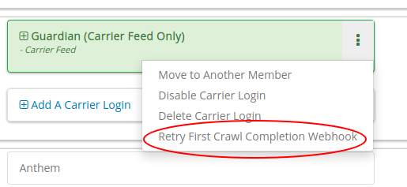

.. _webhooks:

Webhooks
========

-------------
Claim Webhook
-------------

TPA Stream offers a claim webhook feature in which TPA Stream will post new
claims to a customer-provided endpoint. We will POST any new claim that comes
into TPA Stream via this webhook immediately after it is processed.

*****************
Claim Webhook URL
*****************

To edit the claim webhook URL, click on "Account Settings" on the settings page.

..  image:: account-settings.png
   :align: center
   :width: 700

Note that you will only see this setting if the claim webhook feature is enabled.

Once the webhook URL has been updated, all future posts will go to that URL.

**********************
Replaying a Claim Post
**********************

..  image:: replay-claim-webhook.png
   :align: center
   :width: 400

To manually replay a claim post, find the appropriate claim on the claims page
and click the "Replay webhook" button.  If the button is not shown, please
verify that the webhook feature is enabled and a URL is set as described above.
This "replay" functionality is useful for testing, and can also be used to
trigger a webhook for any pre-existing claims that are in the system, if desired.

------------------------------
First Crawl Completion Webhook
------------------------------

TPA Stream also offers a crawl webhook feature that posts details about the
first crawl of a policyholder to a customer-provided endpoint. It will
POST this information after all the claims for the crawl have been processed.
The last POST for a policy holder will occur when the crawl is successful for
the first time. For example, if the first two crawls fail and next two attempts
are successful, 3 POST requests will be made.  Two for the failures and a
third, final POST for the first success.

**********************************
First Crawl Completion Webhook URL
**********************************

To edit the first crawl completion webhook URL, click on "Account Settings"
on the settings page similar to editing the claim webhook URL.

*********************************
Replaying a Crawl Completion Post
*********************************

To manually replay a first completion webhook post, find the appropriate member
on the member page.  Under policy holders, there will be a button to replay
the webhook request.  If the button is not shown, please verify that the
webhook feature is enabled and a URL is set as described above. This “replay”
functionality is useful for testing.  If a crawl for that policy holder has
not happened yet, it will return a failure. Note that the replay will not have
:code:`crawl_claim_ids` and will not be retried upon failure.

---------------
Request Retries
---------------

The request will be an HTTP POST with Content-Type header of application/json.
An example of the JSON you can expect can be found at the end of this document.
For Webhook POSTs, TPA Stream listens for the following codes from your server
and reacts accordingly:

* If TPA Stream receives a :code:`200` or :code:`2xx` (Success) code it will determine the webhook POST is successful and not retry.
* If TPA Stream receives a :code:`406` (Not Acceptable) code, TPA Stream will determine the POST is rejected and not retry.
* For any other code, TPA Stream will retry POSTing with an exponential backoff delay for up to 4 hours.

--------
Security
--------

********************************
TPAStream-Signature Verification
********************************

Also included in the request is a JWT signature that can be used to verify that
the request has originated from TPA Stream, and not any other party.  This
header is passed in the TPAStream-Signature header of the request.  The
signature can be verified using our SSH RSA public key.  The key can be
obtained from https://app.tpastream.com/keys.  The JWT hashing algorithm used is RS256.

We strongly recommend that you verify our JWT signature as a part of your webhook.
Examples of how to decode a JWT in several common programming languages can be found
at https://jwt.io. Note that the JWT library you choose must support RS256
(nearly all of them do), and should also support an exp check (although you could
easily perform this simple expiration date check yourself using a UTC timestamp).

----------------------------------
Example Claim Webhook JSON Request
----------------------------------

.. code-block:: json

   {
      "data": {
         "service_provider_billing_npi_number": null,
         "computed_coinsurance_patient": null,
         "group_name": null,
         "recrawl_requested": null,
         "members": [],
         "group_number": null,
         "eob_date": "2017-07-01T16:51:16.701956",
         "date_column": "2017-07-01T16:51:16.701956+00:00",
         "service_provider_number": "laMhYxXFh",
         "service_provider_billing_number": null,
         "coinsurance_patient": null,
         "modifieddate": "2017-06-01T04:14:29.348875+00:00",
         "total_coinsurance_patient": null,
         "service_provider_billing_address": null,
         "status": "Partially Approved",
         "amount_billed": 228,
         "reduction": null,
         "claim_medical_lines": [{
            "claim_medical_line_id": 10004,
            "procedure_code": "87254 - VIRUS INOCULATION SHELL VIA",
            "days_supply": null,
            "copayment": null,
            "polymorphic__amount_paid": null,
            "date_of_service": {
            "bounds": "[]",
            "start": "2020-01-16",
            "end": "2020-01-17"
            },
            "vendor_system_id": "2b7e0936",
            "polymorphic__patient_responsibility": null,
            "polymorphic__amount_allowed": null,
            "discount": null,
            "total_patient_responsibility": null,
            "coinsurance_patient": null,
            "amount_allowed": null,
            "national_drug_code": null,
            "polymorphic__reduction": null,
            "polymorphic__copayment": null,
            "prescription_type_id": null,
            "patient_responsibility": 0,
            "polymorphic__coinsurance_patient": null,
            "procedure_name": "Preventive Visit-Ages 18-39 - see note E23",
            "prescription_type_str": null,
            "amount_billed": 228,
            "reduction": null,
            "amount_paid": null,
            "polymorphic__amount_billed": null,
            "amount_not_covered": null,
            "diagnosis_code": "M19.172",
            "quantity": null,
            "amount_paid_other": null
         }],
         "amount_paid_other": null,
         "computed_reduction": null,
         "total_reduction": null,
         "vendor_system_id": "28284fbbaa164d02",
         "discount": null,
         "computed_amount_billed": null,
         "total_patient_responsibility": 0,
         "exports": [],
         "service_provider_npi_number": null,
         "patient_responsibility": 0,
         "dataobject_id": 104,
         "remarks": "leverage ubiquitous users",
         "service_provider_billing_name": null,
         "total_copayment": null,
         "network": null,
         "amount_not_covered": null,
         "copayment": null,
         "computed_copayment": null,
         "policy_holder": {
            "last_name": "Parrish",
            "fullname": "Patrick Parrish",
            "policy_holder_id": 104
         },
         "total_amount_billed": 228,
         "total_amount_paid": null,
         "patient_account_number": null,
         "tpafiles": [],
         "date_of_service": {
            "bounds": "[]",
            "start": "2020-01-28",
            "end": "2020-01-28"
         },
         "incurred_value": null,
         "is_incomplete": null,
         "policy_holder_fullname": "Patrick Parrish",
         "id": 10004,
         "type": null,
         "amount_allowed": null,
         "service_provider_address": "1097 Dicha Garden",
         "claim_requests": [],
         "computed_amount_paid": null,
         "check_number": "8858906",
         "last_updated_status": "2020-02-11T13:56:45.249767+00:00",
         "processed_on": "2017-06-21T00:30:46.791615",
         "createddate": "2016-03-17T07:11:30.580677+00:00",
         "computed_amount_allowed": null,
         "dependents": [],
         "patient_payer_number": null,
         "service_provider_billing_phone": null,
         "claim_medical_id": 10004,
         "check_date": "2020-01-24T23:49:50+00:00",
         "computed_patient_responsibility": null,
         "total_amount_allowed": null,
         "amount_paid": null,
         "service_provider": "Salary.com",
         "patient_name": "Abram",
         "policy_holder_id": 104
      }
   }

----------------------------------
Example Crawl Webhook JSON Request
----------------------------------

.. code-block:: json

   {
       "data": {
           "crawl_claim_ids": [
               10004,
               10007,
               10008
           ],
           "success": true
       }
   }
